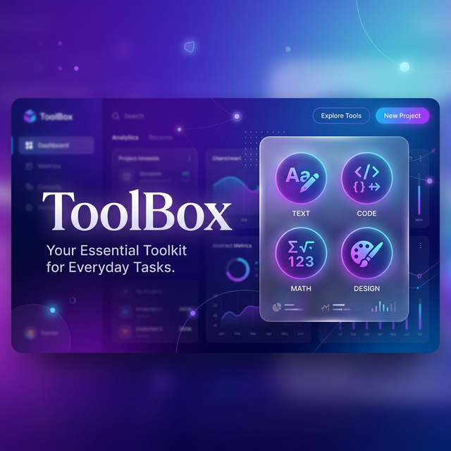

# ToolBox | 究極のオンライン便利ツール集

[](https://antigravity.google)
[](https://opensource.org/licenses/MIT)
[](https://github.com/taksan-cyber/my-portfolio)

ToolBoxは、日常生活や開発作業で頻繁に必要となるツールを一つにまとめた、高速・軽量・高機能なWebアプリケーションです。



## ✨ 特徴

- **13種類以上のツール**: テキスト変換、パスワード生成、計算機、QRコード、JSON整形、単位換算、Markdownプレビューなど。
- **モダンな検索 & フィルタ**: 目的のツールを瞬時に見つけるためのリアルタイム検索とカテゴリ表示。
- **アクセシビリティ (A11y)**: キーボード操作対応、スクリーンリーダー向けARIAラベル完備。
- **完全クライアントサイド処理**: サーバー負荷なし＆プライバシー万全。データはあなたのブラウザ内だけで処理されます。
- **PWA / オフライン対応**: オフラインでも完全動作。モバイルでホーム画面に追加可能。
- **グラスモフィズムUI**: 美しい透明感のあるデザイン。ダークモード、お気に入り、履歴機能を完備。

## 🛠️ 搭載ツール一覧

- **Text**: テキスト変換, 統計情報, Markdownプレビュー, クイックメモ
- **Dev**: パスワード生成 (強度計付), JSON整形 (ツリー表示付), Base64変換, URLエンコード
- **Math**: 計算機, タイマー, 単位換算
- **Design**: QRコード生成, カラーコード変換

## 🚀 技術スタック

- **Frontend**: Vanilla HTML5, CSS3, JavaScript (ES6+)
- **Logic**: 
  - `marked.js` (Markdown 変換)
  - `qrcode.js` (QRコード生成)
- **Framework**: Antigravity Python (Development)
- **Persistence**: LocalStorage (Settings & History)

## 📦 セットアップ

```bash
# 1. リポジトリをクローン
git clone https://github.com/taksan-cyber/my-portfolio.git

# 2. ディレクトリへ移動
cd my-portfolio

# 3. ブラウザで開く
open index.html
```

## 🤝 貢献

バグ報告や機能提案は [GitHub Issues](https://github.com/taksan-cyber/my-portfolio/issues) で受け付けています。
プロジェクトが気に入ったらぜひ ⭐ **Star** をお願いします！

## 📄 ライセンス

このプロジェクトは MIT ライセンスの下で公開されています。

